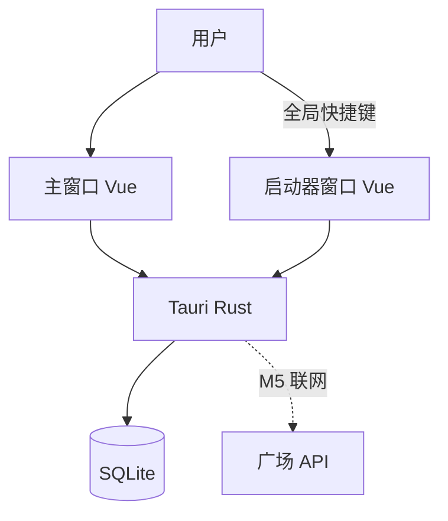

# 架构概览

| 字段 | 值 |
|---|---|
| 状态 | 现行 |
| 阶段 | M5 合同已接受，服务尚未落地 |
| 关联 | [数据模型](data-model.md) · [ADR 0008](decisions/0008-m5-backend-contract.md) |

## 容器

主窗口与启动器共享本机 SQLite。M5 起 Rust 在联网时访问本仓库新合同的广场 API；启动器命令不请求广场。服务进程未落地前，虚线不存在于运行时。

## 子系统

| 子系统 | 职责 | 第一期 |
|---|---|---|
| 主窗口工作台 | 分类树、卡片、编辑/使用/创建设置弹窗 | 按原型重建 |
| 启动器 | 独立窗口搜索、填写、复制、粘贴 | 移植旧实现 |
| 本地数据 | SQLite schema、工作区、FTS、备份 | 按本仓库数据模型新建 |
| 桌面集成 | 快捷键、托盘、剪贴板、粘贴、权限 | 随启动器一起移植 |
| 云与广场 | 认证、广场、发布 | M5：新合同，见 ADR 0008 |

## 窗口

- `main`：工作台。
- `launcher`：独立启动器。失焦隐藏、唤起保护期、粘贴前交还焦点等行为以旧实现为准。
- 登录在主窗口弹窗完成，不另开窗口。启动器不打开登录。

## 前端约定

- Vue 3 + Vite + Pinia + Vue Router（若主窗口需要路由；弹窗流可无路由）。
- 文案简体中文，标识符英语。
- 样式跟原型 `styles.css` 的 token，不沿用旧 Atelier Zero 作为主窗口主题。
- 启动器视觉可保持旧启动器可用性，不要求与原型覆盖层一致。

## 广场后端

合同见 [ADR 0008](decisions/0008-m5-backend-contract.md)。不画旧 Spring 路径。`backend/` 在 Task 0 完成且 OpenAPI 进 INDEX 之后才创建。
