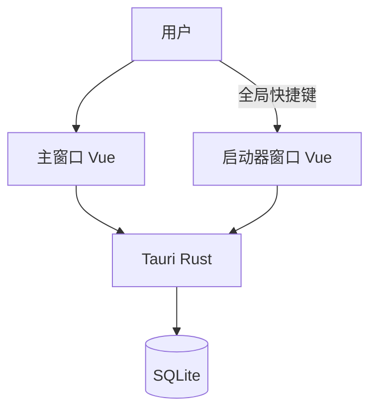

# 架构概览

| 字段 | 值 |
|---|---|
| 状态 | 现行 |
| 阶段 | M0：目标架构。实现从 M1 开始 |
| 关联 | [数据模型](data-model.md) · [ADR](decisions/0001-greenfield-sibling-repo.md) |

## 容器

第一期没有后端进程。主窗口与启动器共享本机 SQLite，经 Rust 命令或同一数据访问层读写。

## 子系统

| 子系统 | 职责 | 第一期 |
|---|---|---|
| 主窗口工作台 | 分类树、卡片、编辑/使用/创建设置弹窗 | 按原型重建 |
| 启动器 | 独立窗口搜索、填写、复制、粘贴 | 移植旧实现 |
| 本地数据 | SQLite schema、工作区、FTS、备份 | 按本仓库数据模型新建 |
| 桌面集成 | 快捷键、托盘、剪贴板、粘贴、权限 | 随启动器一起移植 |
| 云与广场 | 认证、同步、市场、计费 | M5 以后 |

## 窗口

- `main`：工作台。
- `launcher`：独立启动器。失焦隐藏、唤起保护期、粘贴前交还焦点等行为以旧实现为准。
- 第一期不单独做 auth 弹窗窗口。

## 前端约定

- Vue 3 + Vite + Pinia + Vue Router（若主窗口需要路由；弹窗流可无路由）。
- 文案简体中文，标识符英语。
- 样式跟原型 `styles.css` 的 token，不沿用旧 Atelier Zero 作为主窗口主题。
- 启动器视觉可保持旧启动器可用性，不要求与原型覆盖层一致。

## 后期后端

M5 再决定：对接旧 API，或把旧模块迁入本仓库后改合同。在此之前架构图不画 Spring Boot。
